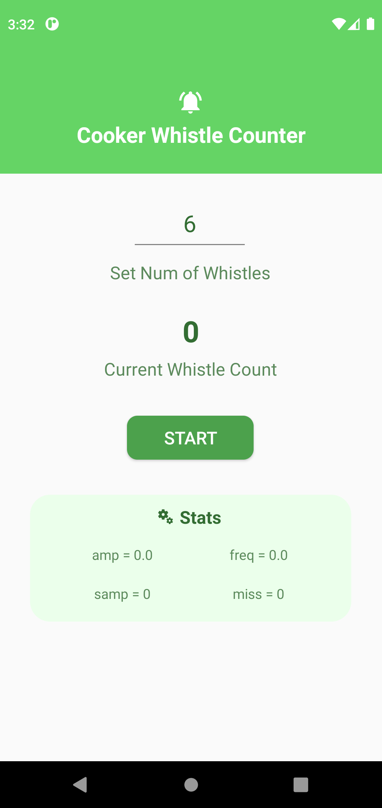

# CookerWhistleCounter

Difficult to track the pressure cooker whistle counts? This Android app makes use of phone (Android only) microphone to count the cooker whistles and rings an alarm once the desired count is reached. No more missing the real count of the whistles, avoid food getting over/under cooked.

Instructions:
1. Keep the phone with the app started within 2 meter distance from the pressure cooker.
2. It does not matter if there are other noise sources around. The app uses combination of amplitude and frequency to detect the cooker-whistle.

<table>
  <tr>
    <td>
      
App screen shot

    </td>
  </tr>
  
  <tr>
    <td>
       
    </td>
  </tr>
</table>
